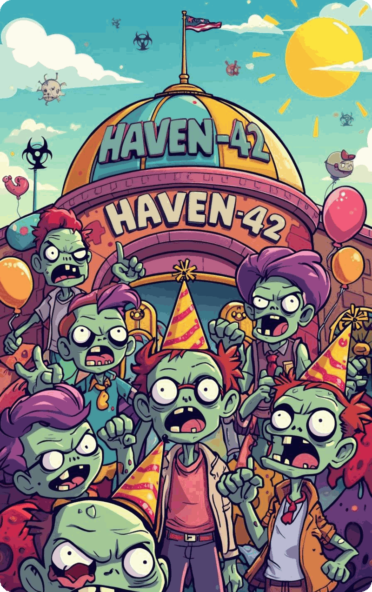

---
hide:
  - toc
---

# 12. Final Challenge — Haven-42

Welcome to the last stage of your Python refresher!  
This challenge brings together everything you have practiced so far: **variables, user input, conditionals, loops**, and a bit of creative thinking.  
You will complete the activity directly in **Google Colab**, using the notebook provided below.

## 🧭 Context: Haven-42, The Last Safe Dome

After the Great Zombie Misunderstanding™, the world is… mostly fine.  
Humans and semi-polite zombies coexist with only the occasional “Was that a greeting or a groan?” confusion.

You are the new **Intake Officer** at **Haven-42**. Your job:

- Talk to incoming survivors  
- Evaluate their answers  
- Decide: **Admit**, **Quarantine**, or **Reject**

Use your Python logic to keep things (relatively) under control.

## 💡 Tips Before You Begin

- Run the notebook **top to bottom**.  
- Test your code often — small steps help.  
- The story is light and fictional; don’t overthink it.  
- Use your logic; creativity is a plus.

## 🎯 What You Will Practice

- Using `input()`  
- Making decisions with `if / elif / else`  
- Combining conditions with Boolean logic  
- Handling multiple cases with loops  
- Structuring clear output

## 🚀 Start the Final Challenge

Click the image below to open the notebook in Google Colab.

  

If the image button doesn’t work, use this link: [Open the Final Challenge notebook ↗](https://colab.research.google.com/drive/1rlAwggVmX6NmQfTOz6u-4fj3dgwcYKsh?usp=sharing){target="_blank" rel="noopener noreferrer"}

## 📘 Learning Goal

By completing this challenge, you should feel confident combining all your core Python skills into one coherent program — readable, logical, and fun to build.

Good luck — and keep Haven-42 safe!

*Image credits: Images used in this notebook were created with Canva’s AI tools (Magic Media) and are used according to Canva’s content guidelines. They were generated for educational purposes.*
